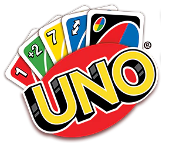
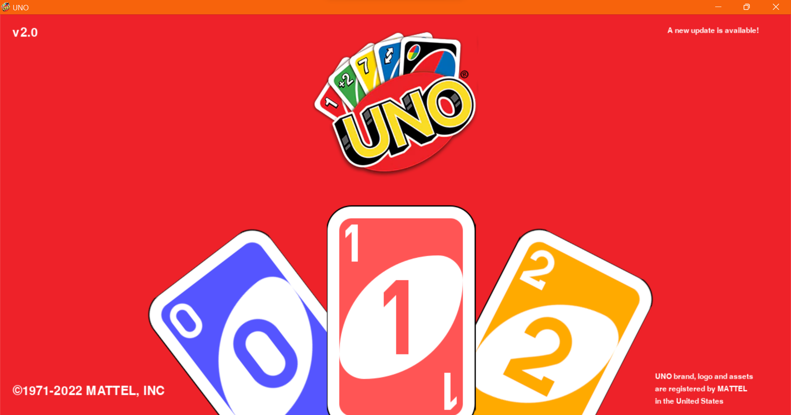
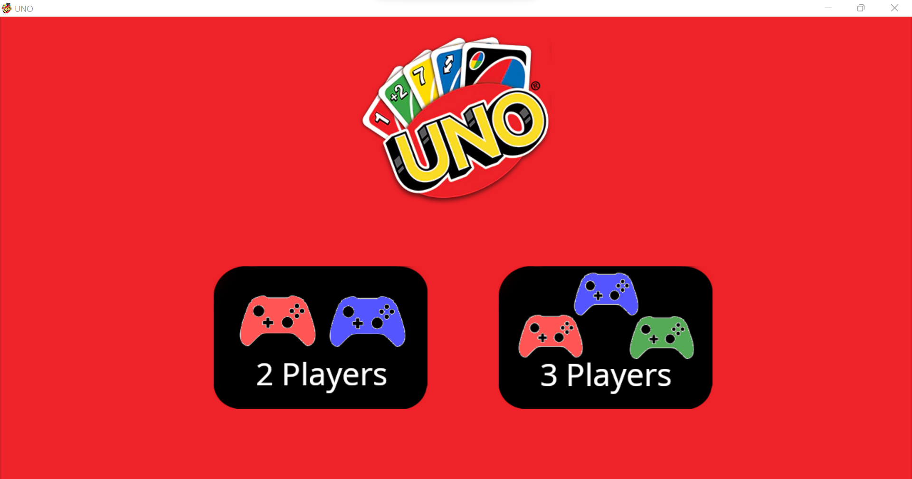
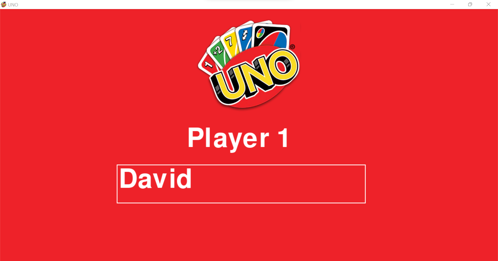
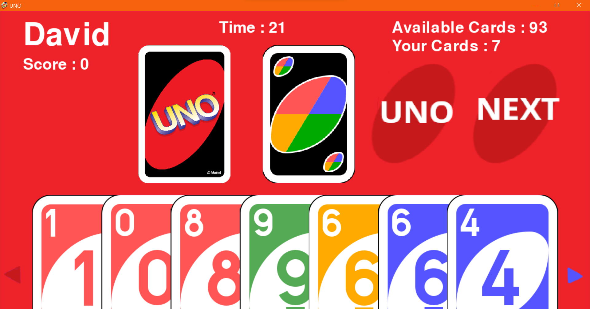

  <br/>

UNO card game made with Python and Pygame


 
<br/>

# Screens






<br/>


# System Requirements

## Minimum
• RAM: 4GB DDR3<br/>
• iGPU: Integrated GPU of the last 4-5 years

## Recommended
• RAM: 8GB DDR4<br/>
• iGPU: Integrated GPU of the last 2 years

# Installation

```GNU/Linux ```
```
git clone https://github.com/daviiid99/UNO.git UNO
cd UNO
python3 main.py
```
<br/>

``` Microsoft Windows```
```
git clone https://github.com/daviiid99/UNO.git UNO
cd UNO
python main.py
```
